# Focus World - Idle / Rogue-lite 2.5D en Flutter Flame

## Vue d'ensemble

Focus World est une application mobile cross-platform (iOS + Android) construite avec Flutter et Flame qui combine productivité et gamification. L'utilisateur utilise des sessions Pomodoro et la marche pour générer des "Fragments de Temps" (FT) qui débloquent du contenu dans un monde 2.5D mystérieux.

### Concept Central
- **Ressource unique** : Fragments de Temps (FT)
- **Génération** : Sessions Pomodoro (25/45/90 min) + Marche (podomètre)
- **Utilisation** : Déverrouillage de contenu, temps de jeu actif, soutien au combat
- **Style** : Monde 2.5D isométrique avec ambiance mystérieuse

## Architecture Technique

### Stack Technologique
- **Framework** : Flutter 3.9+
- **Moteur de jeu** : Flame Engine
- **Plateformes** : iOS, Android
- **Stockage** : SQLite (sqflite) + SharedPreferences
- **Sensors** : pedometer, app_lifecycle

### Architecture Modulaire

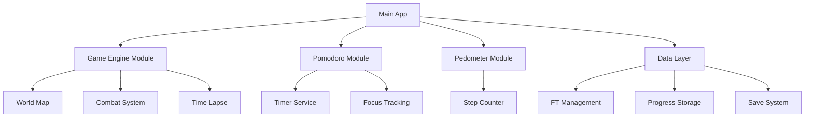

## Modèles de Données

### Fragment de Temps (FT)
```dart
class TimeFragment {
  final String id;
  final int amount;
  final DateTime earnedAt;
  final FragmentSource source; // POMODORO, WALKING
  final Map<String, dynamic> metadata;
}
```

### État du Monde
```dart
class WorldState {
  final String id;
  final List<MapTile> revealedTiles;
  final List<Structure> activeStructures;
  final PlayerPosition currentPosition;
  final int explorationTimeRemaining; // en minutes
  final bool isBossUnlocked;
}
```

### Progression du Joueur
```dart
class PlayerProgress {
  final int totalFTEarned;
  final int currentFTBalance;
  final int totalPomodoroSessions;
  final int totalStepsTaken;
  final int currentWorldLevel;
  final List<Achievement> unlockedAchievements;
  final CombatStats combatStats;
}
```

### Session Pomodoro
```dart
class PomodoroSession {
  final String id;
  final Duration duration; // 25, 45, ou 90 minutes
  final DateTime startTime;
  final DateTime? endTime;
  final SessionStatus status; // ACTIVE, COMPLETED, FAILED
  final int ftEarned;
  final bool wasAppLeft; // pour proof-of-focus
}
```

## Architecture des Composants

### 1. Module Pomodoro

#### PomodoroTimer Component
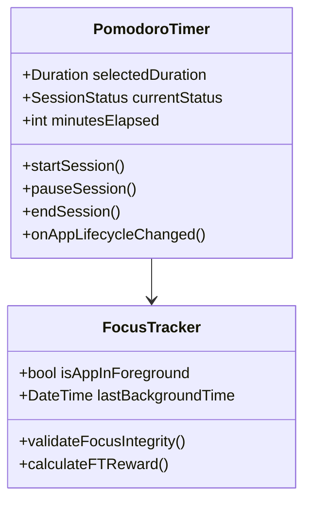

#### Règles de Génération FT
- **1 minute réussie** = 1 FT
- **Échec si l'app est quittée** > 30 secondes
- **Bonus de fin de session** : +5 FT pour session complète

### 2. Module Podomètre

#### StepCounter Component
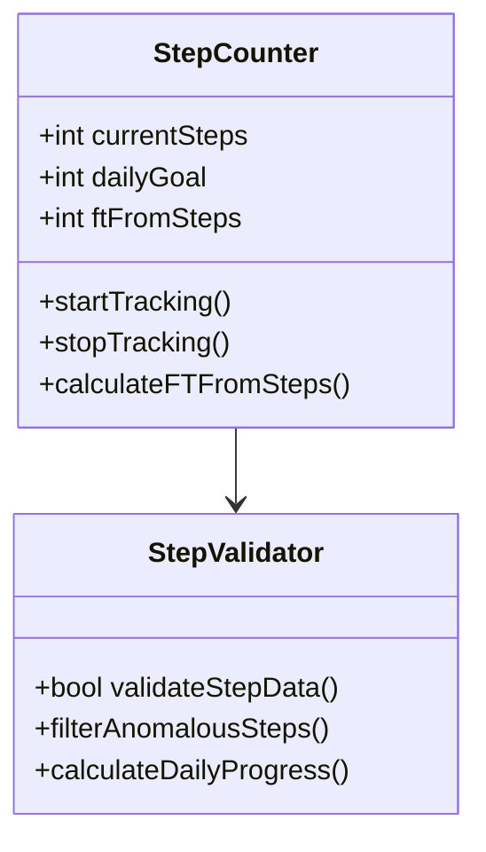

#### Règles de Conversion
- **100 pas** = 1 FT
- **Validation anti-triche** : max 20,000 pas/jour comptabilisés
- **Bonus quotidien** : +10 FT pour atteindre 10,000 pas

### 3. Module Monde 2.5D

#### Carte Isométrique
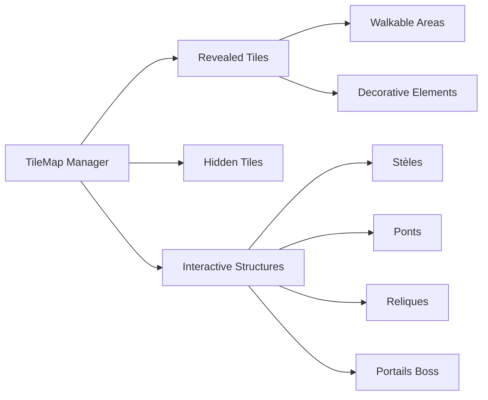

#### Types de Tuiles
| Type | Description | Coût FT | Effet |
|------|-------------|---------|-------|
| Terrain de base | Sol, herbe, pierre | 0 | Déplacement libre |
| Stèle mystique | Point d'activation | 50 FT | +5 min temps d'exploration |
| Pont ancien | Connexion entre zones | 100 FT | Accès nouvelles zones |
| Relique temporelle | Objet rare | 200 FT | Bonus combat permanent |
| Portail boss | Accès mode combat | 500 FT | Débloque vagues d'ennemis |

#### Système d'Exploration Active

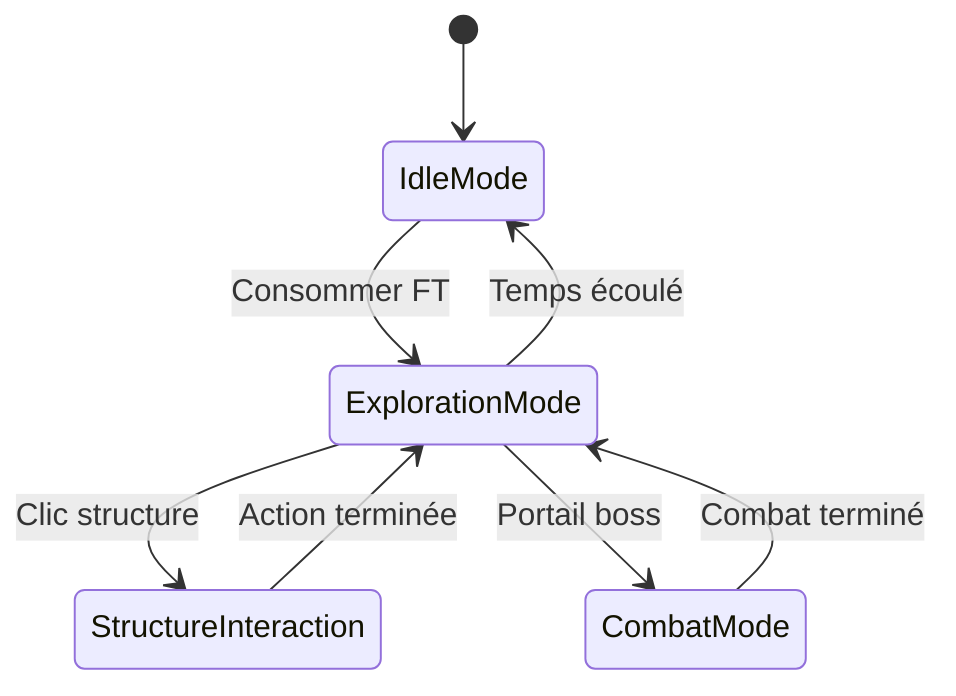

**Règles d'Exploration :**
- **Ratio temps** : 1h focus = 15 min exploration
- **Cap quotidien** : 45 min max/jour
- **Déplacement** : Tap-to-move avec pathfinding A*
- **Interactions** : Tap sur structure pour activer

### 4. Système de TimeLapse

#### Révélation Progressive
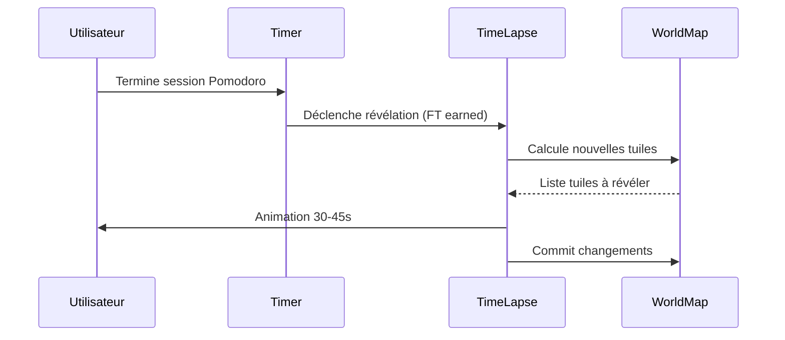

#### Éléments de TimeLapse
- **Durée** : 30-45 secondes maximum
- **Effets visuels** : Brume qui se dissipe, glow doux
- **Audio** : Sons mystérieux, carillon subtil
- **Révélations** : 1-3 nouvelles tuiles par session selon FT

### 5. Système de Combat par Vagues

#### Mécaniques de Combat
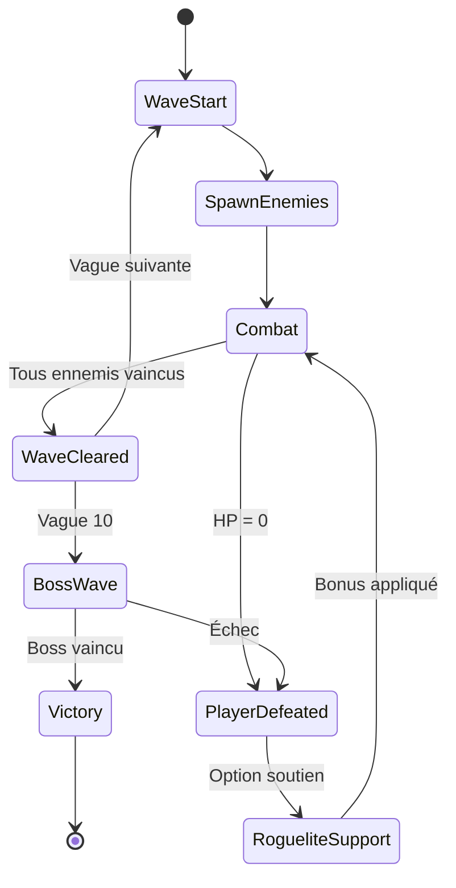

#### Stats de Combat de Base
```dart
class CombatStats {
  int health = 100;
  int attack = 10;
  int defense = 5;
  int criticalChance = 5; // %
  double attackSpeed = 1.0; // attaques/seconde
}
```

#### Progression Exponentielle
- **Vague 1-3** : Slimes faibles (10 HP, 5 ATK)
- **Vague 4-6** : Golems (25 HP, 8 ATK)
- **Vague 7-9** : Ombres rapides (15 HP, 12 ATK)
- **Vague 10** : Boss Gardien Temporel (200 HP, 15 ATK, capacités spéciales)

### 6. Soutien Tactique (Rogue-lite)

#### Système de Bonus Aléatoires
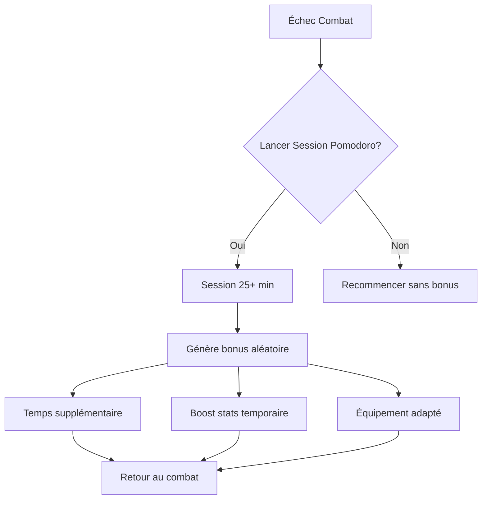

#### Types de Bonus
| Bonus | Description | Durée | Probabilité |
|-------|-------------|-------|-------------|
| Temps bonus | +30 sec timer combat | 1 combat | 40% |
| Boost attaque | +50% dégâts | 1 combat | 25% |
| Boost défense | +30% réduction dégâts | 1 combat | 25% |
| Équipement rare | Arme/armure temporaire | 3 combats | 10% |

## Flux Utilisateur Principal

### Parcours d'Onboarding
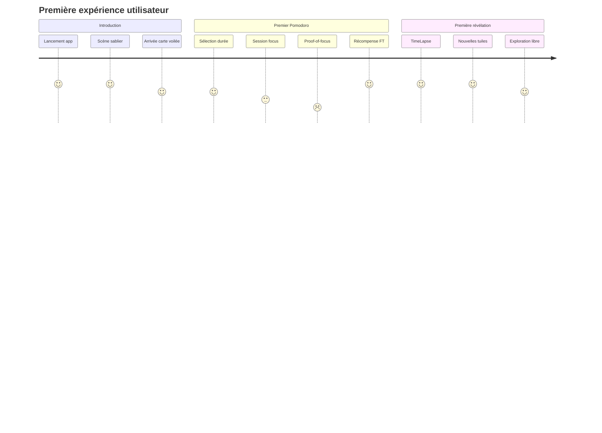

### Boucle de Jeu Quotidienne
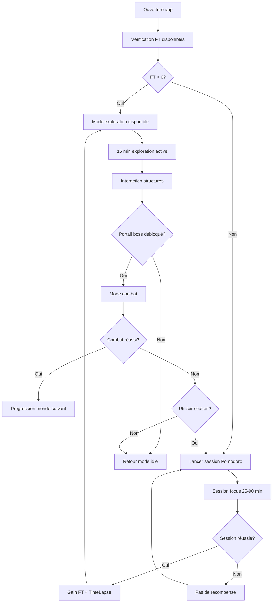

## Interface Utilisateur

### Écrans Principaux

#### 1. Écran Principal (Hub)
- **Compteur FT** : Affichage proéminent en haut
- **Bouton Pomodoro** : Accès rapide aux sessions
- **Aperçu carte** : Vue miniature du monde actuel
- **Compteur pas** : Progression quotidienne
- **Temps exploration restant** : Si disponible

#### 2. Écran Pomodoro
- **Sélecteur durée** : 25/45/90 min avec boutons visuels
- **Timer circulaire** : Progression visuelle claire
- **Indicateur focus** : Statut app (foreground/background)
- **Motivation** : Estimation FT à gagner

#### 3. Écran Carte 2.5D
- **Vue isométrique** : Carte principale avec zoom/pan
- **HUD exploration** : Temps restant, FT actuels
- **Mini-map** : Navigation rapide
- **Inventaire** : Objets ramassés

#### 4. Écran Combat
- **Zone de combat** : Affichage 2.5D des entités
- **Barres de vie** : Joueur et ennemis
- **Compteur vague** : Progression actuelle
- **Boutons capacités** : Actions disponibles

### Composants UI Réutilisables
```dart
// Widget principal pour affichage FT
class TimeFragmentDisplay extends StatelessWidget {
  final int currentFT;
  final bool showGainAnimation;
}

// Widget timer Pomodoro
class PomodoroTimerWidget extends StatefulWidget {
  final Duration selectedDuration;
  final Function(int) onFTEarned;
}

// Widget carte monde
class WorldMapWidget extends StatefulWidget {
  final WorldState worldState;
  final Function(String) onTileInteraction;
}
```

## Système de Progression

### Métaméchaniques

#### Unlock Progression
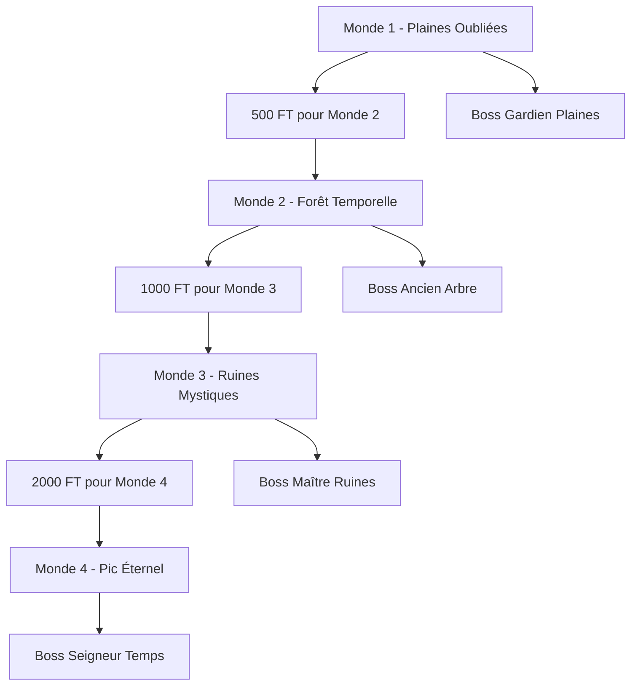

#### Achievements System
| Achievement | Description | Récompense |
|-------------|-------------|------------|
| Premier Pas | Terminer 1ère session Pomodoro | +50 FT |
| Marcheur Assidu | 10,000 pas en un jour | +100 FT |
| Explorateur | Révéler 50 tuiles | Nouveau skin carte |
| Maître du Temps | 100 sessions Pomodoro | Bonus permanent +1 FT/min |
| Vainqueur | Battre premier boss | Débloque équipements |

### Économie des FT

#### Sources de Génération
- **Pomodoro** : 25-90 FT par session
- **Marche** : 1 FT per 100 pas
- **Bonus quotidiens** : Jusqu'à 50 FT/jour
- **Achievements** : 25-200 FT ponctuels

#### Utilisation des FT
- **Temps d'exploration** : 10 FT = 1 minute
- **Révélation tuiles** : 20-100 FT selon type
- **Soutien combat** : 50 FT pour bonus aléatoire
- **Accélération** : 100 FT pour skip TimeLapse

## Architecture Sauvegarde

### Structure de Données Locale
```dart
class GameSave {
  final PlayerProgress playerProgress;
  final WorldState currentWorld;
  final List<PomodoroSession> sessionHistory;
  final Map<String, dynamic> achievements;
  final DateTime lastPlayTime;
  final int saveVersion;
}
```

### Stratégie de Persistence
- **Sauvegarde automatique** : Toutes les 30 secondes en jeu
- **Sauvegarde forcée** : Fin de session, changement d'écran
- **Backup cloud** : Optionnel via Google Play Games / Game Center
- **Migration de données** : Versioning pour mises à jour

## Tests et Métriques

### Tests Unitaires Critiques
- **PomodoroTimer** : Validation génération FT
- **FocusTracker** : Détection sortie d'app
- **StepCounter** : Conversion pas vers FT
- **WorldState** : Cohérence révélation tuiles
- **CombatSystem** : Calculs dégâts et progression

### Métriques de Jeu
- **Rétention J1/J7/J30** : Engagement utilisateur
- **Sessions Pomodoro/jour** : Productivité réelle
- **Temps exploration moyen** : Équilibre idle/actif
- **Taux conversion FT** : Économie du jeu
- **Progression par utilisateur** : Difficulté des bosses

### Tests de Performance
- **Rendu 2.5D** : 60 FPS stable sur dispositifs mid-range
- **Animations TimeLapse** : Fluidité sans frame drop
- **Gestion mémoire** : < 150MB RAM usage
- **Batterie** : < 5% drain par heure en mode idle


